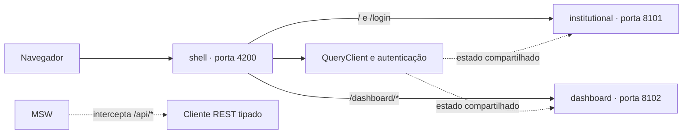

# ByteBank — FIAP Front-End Engineering Tech Challenge

Aplicação de banking digital desenvolvida em um monorepo Nx com React, Next.js e TypeScript. A experiência principal usa uma arquitetura de microfrontends com Module Federation: o `shell` compõe os remotes `institutional` e `dashboard`, enquanto o app Next.js `banking` permanece disponível de forma independente.

## Sumário

- [Sobre o projeto](#sobre-o-projeto)
- [Funcionalidades](#funcionalidades)
- [Arquitetura](#arquitetura)
- [Tecnologias](#tecnologias)
- [Estrutura do projeto](#estrutura-do-projeto)
- [Requisitos](#requisitos)
- [Configuração](#configuração)
- [Executando localmente](#executando-localmente)
- [Credenciais de demonstração](#credenciais-de-demonstração)
- [Rotas](#rotas)
- [Testes e qualidade](#testes-e-qualidade)
- [Storybook](#storybook)
- [Docker](#docker)
- [Deploy na Vercel](#deploy-na-vercel)
- [Scripts disponíveis](#scripts-disponíveis)
- [Documentação complementar](#documentação-complementar)

## Sobre o projeto

O ByteBank simula uma plataforma de controle financeiro pessoal. A aplicação oferece uma landing page pública, autenticação, dashboard financeiro e gerenciamento de transações.

Os dados são consumidos por contratos REST tipados. Durante o desenvolvimento e os testes, o Mock Service Worker (MSW) intercepta essas requisições e simula a API sem acoplar os componentes às fixtures. O estado de servidor, incluindo autenticação, dashboard, perfil e transações, é gerenciado pelo TanStack Query.

## Funcionalidades

- Landing page responsiva com conteúdo institucional.
- Login e logout com proteção das rotas autenticadas.
- Dashboard com saldo, receitas, despesas e indicadores financeiros.
- Gráficos de fluxo financeiro e distribuição por categoria.
- Extrato com busca, filtros e paginação.
- Cadastro, visualização, edição e exclusão de transações.
- Inclusão e remoção de anexos em transações.
- Páginas específicas para entradas, saídas e perfil.
- Temas claro e escuro com persistência local.
- Conteúdo em português, inglês e espanhol.
- Componentes acessíveis baseados em Radix UI.
- Testes unitários, de integração e de ponta a ponta.
- Execução local ou em containers Docker.

## Arquitetura

A experiência federada é formada por três aplicações React independentes:



| Projeto | Responsabilidade | Execução local |
| --- | --- | --- |
| `shell` | Host da composição, roteamento, autenticação global e `QueryClient` | `http://localhost:4200` |
| `institutional` | Remote da landing page e do login; também funciona standalone | `http://localhost:8101` |
| `dashboard` | Remote das áreas autenticadas e operações financeiras; também funciona standalone | `http://localhost:8102` |
| `banking` | Aplicação Next.js 14 preservada para compatibilidade durante a evolução arquitetural | `http://localhost:3000` |
| `shell-e2e` | Suíte Playwright que valida o fluxo integrado dos três microfrontends | — |

O shell carrega apenas o remote exigido pela rota atual. Falhas de carregamento são isoladas e apresentam uma opção de nova tentativa. `React`, `React DOM`, `styled-components`, `TanStack Query` e a autenticação compartilhada são configurados como singletons na federação.

Os remotes expõem `./App` por meio de seus respectivos arquivos `remoteEntry.js`. Quando executados isoladamente, criam seus próprios providers; dentro da composição, utilizam os providers globais do shell.

As decisões e os limites de responsabilidade completos estão em [`docs/ARCHITECTURE.md`](docs/ARCHITECTURE.md).

## Tecnologias

### Aplicação e arquitetura

- React 18 e React DOM.
- Next.js 14 com App Router no app `banking`.
- Nx 23 para organização, execução de targets e cache.
- Module Federation Enhanced para composição dos microfrontends.
- Rspack para build e servidor de desenvolvimento dos apps federados.
- TypeScript.
- `styled-components`.

### Interface e dados

- Radix UI para primitivas acessíveis.
- TanStack Query para estado de servidor, cache e mutações.
- MSW para a API REST mockada em desenvolvimento e testes.
- React Hook Form e Zod para formulários e validação.
- Recharts e Chart.js para visualização de dados.
- Lucide React para ícones.

### Testes e qualidade

- Jest e React Testing Library para testes unitários e de integração.
- Playwright para testes E2E do fluxo federado.
- Storybook 8 para documentação visual de componentes.
- ESLint 9 e TypeScript para análise estática.

### Infraestrutura

- Docker e Docker Compose.
- Nginx nas imagens de produção dos microfrontends.

## Estrutura do projeto

```text
.
├── apps/
│   ├── banking/              # Aplicação Next.js independente
│   ├── shell/                # Host da composição federada
│   ├── institutional/        # Remote da landing page e login
│   ├── dashboard/            # Remote das áreas autenticadas
│   └── shell-e2e/            # Testes E2E com Playwright
├── libs/shared/
│   ├── api-client/           # Cliente REST tipado e endpoints
│   ├── auth/                 # Autenticação compartilhada
│   ├── query/                # Configuração do TanStack Query
│   ├── testing/              # Handlers, fixtures e setup do MSW
│   ├── types/                # Contratos de domínio compartilhados
│   └── ui/                   # Componentes Radix e estilos reutilizáveis
├── tools/module-federation/  # Configuração compartilhada da federação
├── docs/                     # Arquitetura, containers e auditorias
├── .storybook/               # Configuração do Storybook
├── compose.yaml              # Ambiente Docker de produção
├── compose.dev.yaml          # Ambiente Docker de desenvolvimento
├── nx.json                   # Configuração do workspace Nx
└── package.json              # Scripts e dependências
```

## Requisitos

- Node.js `20.19+` ou `22.13+`.
- npm.
- Docker e Docker Compose, caso queira executar a aplicação em containers.

## Configuração

Clone o repositório e instale as dependências:

```bash
git clone https://github.com/bahguima/fiap-frontend-enginner-tech-challenge-2.git
cd fiap-frontend-enginner-tech-challenge-2
npm install
```

Crie o arquivo de ambiente local a partir do exemplo:

```bash
cp .env.example .env.local
```

No PowerShell:

```powershell
Copy-Item .env.example .env.local
```

Variáveis disponíveis:

| Variável | Padrão | Descrição |
| --- | --- | --- |
| `NEXT_PUBLIC_API_BASE_URL` | vazio | URL da API REST; vazio usa a mesma origem da aplicação |
| `NEXT_PUBLIC_API_MOCKING` | `enabled` em desenvolvimento | Ativa ou desativa o MSW no navegador |
| `NEXT_PUBLIC_API_MOCK_DELAY_MS` | `150` | Latência padrão dos handlers, em milissegundos |
| `INSTITUTIONAL_REMOTE_URL` | `http://127.0.0.1:8101/remoteEntry.js` | Entrada do remote institucional consumida pelo shell |
| `DASHBOARD_REMOTE_URL` | `http://127.0.0.1:8102/remoteEntry.js` | Entrada do remote de dashboard consumida pelo shell |
| `SHELL_PUBLIC_URL` | `http://127.0.0.1:4200` | URL usada pelo dashboard standalone para retornar ao login do shell |

As URLs dos remotes e da API são incorporadas ao bundle no build. Em produção, informe endereços acessíveis pelo navegador.

Com o MSW ativo, é possível simular erros com o header `x-mock-error: true` ou o parâmetro `?mockError=true`. O header `x-mock-delay-ms` sobrescreve a latência de uma requisição.

## Executando localmente

Inicie o shell e os dois remotes:

```bash
npm run dev
```

A aplicação completa estará disponível em `http://localhost:4200`. Os remotes também poderão ser acessados isoladamente:

- Institucional: `http://localhost:8101`.
- Dashboard: `http://localhost:8102`.

Para iniciar apenas um projeto:

```bash
npm run dev:shell
npm run dev:institutional
npm run dev:dashboard
```

O app Next.js independente pode ser executado em `http://localhost:3000`:

```bash
npm run dev:banking
```

## Credenciais de demonstração

```text
E-mail: email@teste.com
Senha: 123
```

## Rotas

| Rota | Responsável | Descrição |
| --- | --- | --- |
| `/` | `institutional` | Landing page |
| `/login` | `institutional` | Autenticação |
| `/dashboard` | `dashboard` | Visão geral financeira |
| `/dashboard/statement` | `dashboard` | Extrato de transações |
| `/dashboard/income` | `dashboard` | Entradas |
| `/dashboard/expenses` | `dashboard` | Saídas |
| `/dashboard/profile` | `dashboard` | Perfil do usuário |

O acesso direto a qualquer rota `/dashboard/*` sem uma sessão válida redireciona para `/login`.

## Testes e qualidade

### Testes unitários e de integração

```bash
npm test
```

Para executar em modo de observação:

```bash
npm run test:watch
```

### Testes E2E com Playwright

Instale o navegador do Playwright na primeira execução:

```bash
npx playwright install chromium
```

Execute a suíte E2E:

```bash
npm run e2e
```

O Playwright inicia automaticamente `institutional`, `dashboard` e `shell`, executa os testes no Chromium e reutiliza servidores que já estejam ativos fora do CI. A suíte cobre landing page, navegação para o login, credenciais inválidas, autenticação, proteção de rota e logout.

Para abrir a interface interativa:

```bash
npm run e2e:ui
```

### Verificações estáticas e build

```bash
npm run lint
npm run typecheck
npm test
npm run build
```

O Nx executa os targets aplicáveis e reutiliza resultados do cache quando as entradas não mudaram.

## Storybook

Inicie o catálogo de componentes:

```bash
npm run storybook
```

Acesse `http://localhost:6006`.

Para gerar a versão estática em `storybook-static/`:

```bash
npm run build-storybook
```

## Docker

Há um Dockerfile multi-stage para cada aplicação federada. As imagens finais usam Nginx e expõem o endpoint de saúde `/healthz`.

Crie um arquivo de configuração opcional:

```bash
cp .env.docker.example .env.docker
```

No PowerShell:

```powershell
Copy-Item .env.docker.example .env.docker
```

### Ambiente de produção

```bash
npm run docker:build
npm run docker:up
npm run docker:down
```

O Compose de produção desativa o MSW. Configure `NEXT_PUBLIC_API_BASE_URL` antes do build para consumir uma API real.

### Ambiente de desenvolvimento

```bash
npm run docker:dev
npm run docker:dev:down
```

O ambiente de desenvolvimento inicia os três servidores Rspack e ativa os mocks REST por padrão. Para usar valores de `.env.docker`, execute diretamente o Compose com `--env-file`:

```bash
docker compose --env-file .env.docker -f compose.dev.yaml up --build
```

Consulte [`docs/CONTAINERS.md`](docs/CONTAINERS.md) para variáveis, health checks e detalhes das imagens.

## Deploy na Vercel

O arquivo `vercel.json` configura o projeto Vercel atual para gerar o app Next.js `banking` com `npm run build:banking` e publicar o diretório `apps/banking/.next`. Essa configuração evita que o deploy procure incorretamente por `.next` na raiz do monorepo.

A composição federada completa requer três projetos/deployments independentes: `shell`, `institutional` e `dashboard`. Nesse cenário, configure em cada projeto o build e o diretório de saída do app correspondente, além das URLs públicas `INSTITUTIONAL_REMOTE_URL`, `DASHBOARD_REMOTE_URL` e `SHELL_PUBLIC_URL`.

## Scripts disponíveis

| Script | Descrição |
| --- | --- |
| `npm run dev` | Inicia shell, institutional e dashboard |
| `npm run dev:banking` | Inicia o app Next.js independente |
| `npm run dev:shell` | Inicia somente o shell |
| `npm run dev:institutional` | Inicia somente o remote institucional |
| `npm run dev:dashboard` | Inicia somente o remote de dashboard |
| `npm run build` | Gera todos os builds disponíveis no workspace |
| `npm run build:banking` | Gera somente o build do app Next.js |
| `npm run build:federation` | Gera os três builds federados |
| `npm run build:shell` | Gera somente o shell |
| `npm run build:institutional` | Gera somente o remote institucional |
| `npm run build:dashboard` | Gera somente o remote de dashboard |
| `npm run start` | Gera e inicia o app Next.js em modo de produção |
| `npm run lint` | Executa o ESLint nos projetos Nx |
| `npm run typecheck` | Executa o TypeScript sem emitir arquivos |
| `npm test` | Executa os testes Jest |
| `npm run test:watch` | Executa o Jest em modo de observação |
| `npm run e2e` | Executa os testes Playwright no Chromium |
| `npm run e2e:ui` | Abre a interface do Playwright |
| `npm run storybook` | Inicia o Storybook |
| `npm run build-storybook` | Gera o Storybook estático |
| `npm run docker:build` | Gera as imagens de produção |
| `npm run docker:up` | Gera e inicia os containers de produção |
| `npm run docker:down` | Encerra os containers de produção |
| `npm run docker:dev` | Inicia os containers de desenvolvimento |
| `npm run docker:dev:down` | Encerra os containers de desenvolvimento |
| `npm run graph` | Abre o grafo de projetos do Nx |

## Documentação complementar

- [`docs/ARCHITECTURE.md`](docs/ARCHITECTURE.md): decisões arquiteturais e limites entre as camadas.
- [`docs/CONTAINERS.md`](docs/CONTAINERS.md): Dockerfiles, Compose, variáveis e health checks.
- [`docs/AUDIT_ACCESSIBILITY_PERFORMANCE_SECURITY.md`](docs/AUDIT_ACCESSIBILITY_PERFORMANCE_SECURITY.md): auditoria de acessibilidade, performance e segurança.
- [`docs/TECHNICAL_DEBT.md`](docs/TECHNICAL_DEBT.md): inventário de dívida técnica e evolução planejada.
